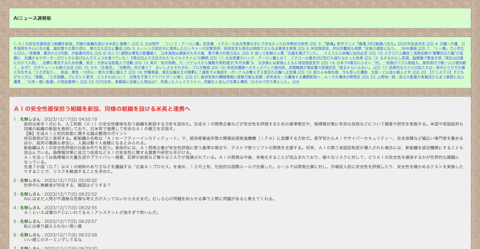

# llmchan: GPT2 fine-tuned to comment on Japanese news articles!

5ch (formerly [2ch](https://en.wikipedia.org/wiki/2channel)) is a popular Japanese online form similar to reddit where people discuss various topics across multiple boards, which is the equivalent of subreddits. There are multiple boards dedicated to news where people post random comments on news articles. 

llmchan is a [Japanese GPT2 model](https://huggingface.co/rinna/japanese-gpt-1b) (which is provided by Rinna Co., Ltd.) fine-tuned to comment on Japanese news articles. The model is trained with the dataset generated form actual comments on one such board. It also has its own web UI.

[You can try out the web UI from here](http://llmchan.peryaudo.org/)

## Repository structure

* `modeling/gpt2-large`: Model training code using Hugging Face Transformers
* `web`: Flask based web UI 
* `batch`: Batch inference code
* `dataset`: Code for scraping 5ch and generating the dataset
* `experiments`, `notebooks`: Code for various experiments e.g. data cleansing, trying out fewshot with existing instruction-tuned models

## License

MIT
